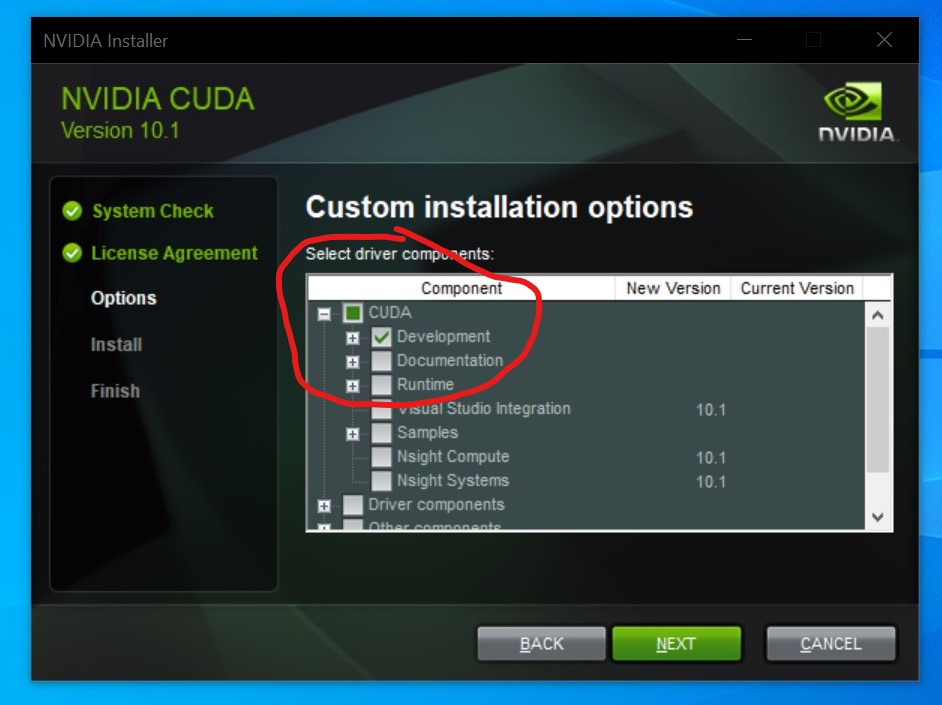

Install Visual Studio Community 2019.

Make sure Miniconda3 is installed at C:\Miniconda3

For your convenience, C:\Miniconda3\Scripts should be in your PATH.

Download & install CUDA. Do a custom install and make sure the only checked option is the Development components.

http://developer.download.nvidia.com/compute/cuda/10.1/Prod/network_installers/cuda_10.1.243_win10_network.exe

Create a new conda environment

    $ conda create --name pytorch
    $ conda activate pytorch

Install python 3.7

    $ conda install python=3.7

Install pytorch, torchvision, and cudatoolkit

    $ conda install pytorch=1.4 torchvision=0.5 cudatoolkit=10.1 -c pytorch

Install fvcore, cython and pycocotools

    $ pip install git+https://github.com/xdaimon/fvcore
    $ pip install cython==0.29.14
    $ pip install git+https://github.com/xdaimon/cocoapi.git#subdirectory=PythonAPI

Change the file

    C:\Miniconda3\envs\pytorch\Lib\site-packages\torch\include\torch\csrc\jit\argument_spec.h(190)
      static constexpr size_t DEPTH_LIMIT = 128;
        change to -->
      static const size_t DEPTH_LIMIT = 128;

And

    C:\Miniconda3\envs\pytorch\Lib\site-packages\torch\include\pybind11\cast.h(1449)
      explicit operator type&() { return *(this->value); }
        change to -->
      explicit operator type&() { return *((type*)this->value); }

Then run the following commands (might take 5-20 minutes)

    $ pip install git+https://github.com/xdaimon/detectron2.git
    $ pip install opencv-python==4.2.0.32 pyqt5==5.14.1

